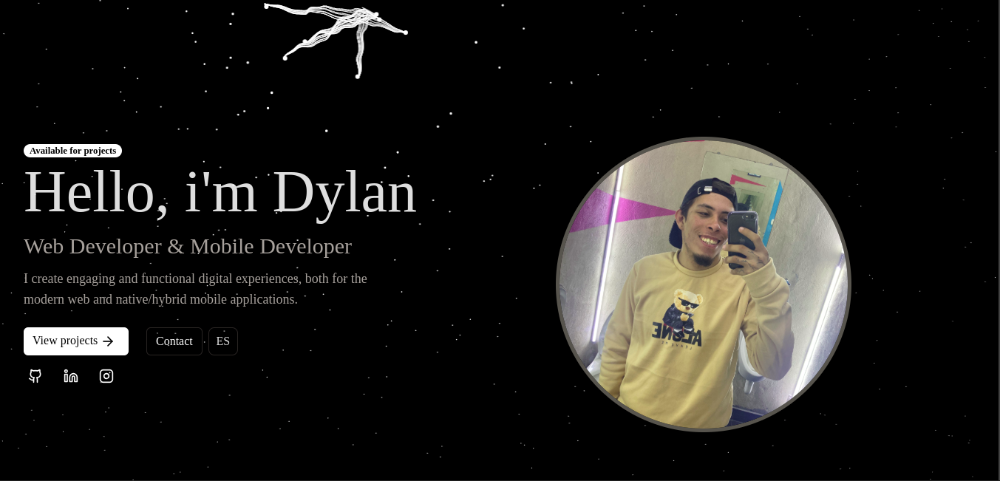

# DevSphere 🚀

Welcome to **DevSphere**, my personal portfolio built with **React** and **TypeScript**! This project showcases my work, skills, and featured projects, crafted with modern technologies and best practices.

---

## Screenshots 🖼️

  
DevSphere homepage showcasing web development_

---

## Features ✨

- **Modern & Responsive Design**: Clean and adaptable interface for all devices.
- **Featured Projects**: Highlights of my most relevant work.
- **Contact Section**: Easy access for collaborations or inquiries.
- **Cutting-Edge Technologies**: Built with React, TypeScript, and the latest tools.

---

## Technologies Used 🛠️

- **React**: Core library for building the interface.
- **TypeScript**: For safer and more maintainable code.
- **HTML5 & CSS3**: Structure and support.
- **TailwindCSS**: Styling.

---

## Installation ⚙️

Follow these steps to run the project locally:

1. Clone the repository:

```bash
   git clone git@github.com:DumbNoxx/DevSphere.git
   cd DevSphere
```

2. Install dependencies:

```bash
   npm install
```

3. Start the development server:
```bash
   npm run dev
```
---

## How to Contribute 🤝

Contributions are welcome! If you have any ideas or suggestions, follow these steps:

1. Fork the project.
2. Create a feature branch `(git checkout -b feature/new-feature)`.
3. Commit your changes `(git commit -m 'Add some new feature').`
4. Push to the branch `(git push origin feature/new-feature).`
5. Open a Pull Request.

---

## License 📄

This project is licensed under the **MIT License**. For more details, see the [LICENSE](LICENSE).

---

## Contact 📧

Have a question or want to collaborate? Feel free to reach out!

- **LinkedIn**: [Dylan Marcano](https://www.linkedin.com/in/dylan-marcano-994205266)
- **DevSphere**: [DevSphere](https://nxus-dev-sphere.vercel.app/)

---

Thanks for visiting **DevSphere**! I hope you enjoy exploring my work as much as I enjoyed building it. 😊
